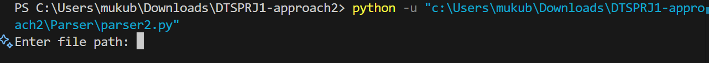

# DTSPRJ1
Invoice / UPI parser

## Install Dependencies
install the required modules

for best and safe use create and use a venv:
```bash
python -m venv venv

.venv\Scripts\activate
```
To install the dependencies:
```bash
pip install requirements.txt
```
## How to use:

**BEFORE YOU RUN THE CODE MAKE SURE YOUR RUNNING IT IN THE CORRECT DIRECTORY :
that is inside your DTSPRJ1 folder.**


Run program and enter the file path you need parsed :


**[NOTE:]** use of " " throws an error . Do not use " " while entering file path.

example: 

with quotes: throws an error
**["c:\users\documents\filename.png"]**- this wont work

without quotes:works
**[c:\users\documents\filename.png]**- works
